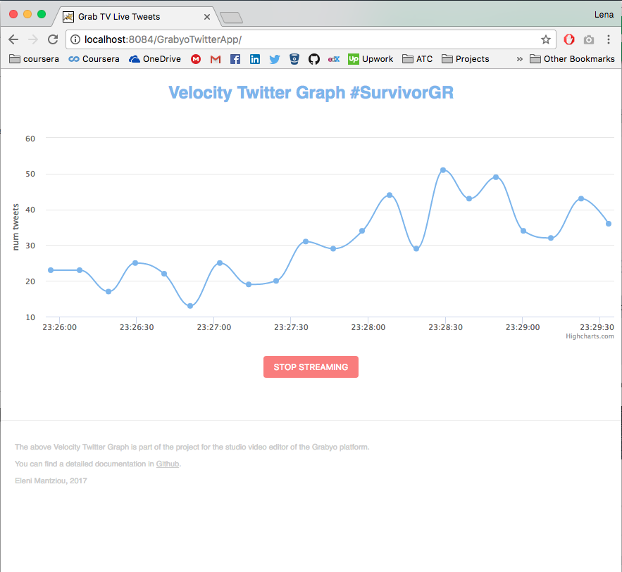
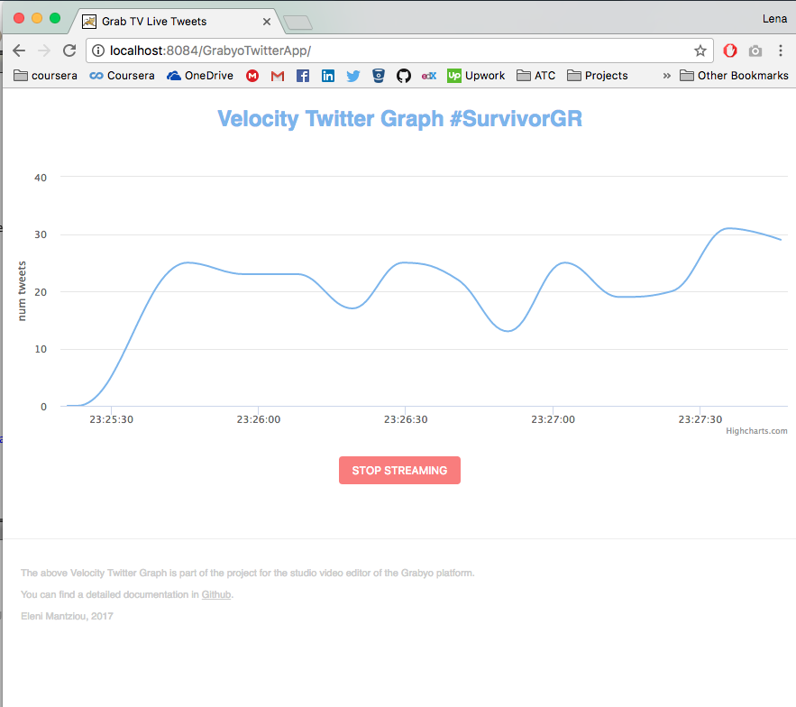
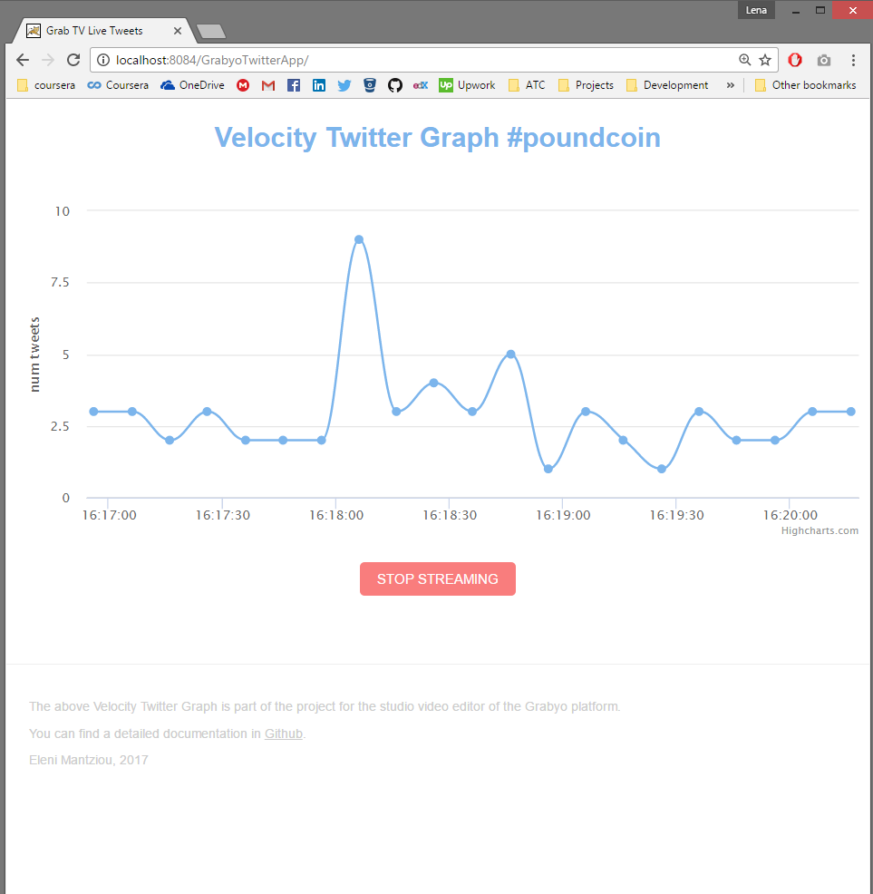

# grabyoApp
twitter crawler - count tweets real-time and updates the graph periodically.
This code is for testing purposes for Grabyo.

# Description of the strategy
## Main Objectives

The main scope of this challenge it to provide a solution to implemente a twitter velovcity graph for the studio video editor of grabyo platform. The graph should record the number of tweets per given time (10,20...60 seconds) for a given hashtag. The graph should update the data real-time.

## Analysis of strategy

Twitter provides two streaming APIs, the Stream and REST API. Both of them have pros and cons, however in this implementation it is decided to use the REST API. The main purpose of this decision is that Stream API provides a connection to retrieve data real-time and it is necessary to store the data in order to count the number of tweets. In other words, it's against the philosophy of Stream API to open/close socket connections. In this implementation a database is not used. Therefore, REST API is more suitable to retrieve data in given time. The main limitation of REST API is that allows to retrieve max 100 tweets/request. Moreover, an application account can make 450 requests every 15 mins, as reported [here](https://dev.twitter.com/rest/reference/get/search/tweets). For the purpose of this project, the minimum range between two requests is 10 secs. Therefore, this application can call 5/10 secs the REST API and retrieve up to 500 tweets. We consider that 500 max tweets/10secs is enough for the sake of this project and we don't miss any tweet. 
The main strategy of this implementation to retrieve real-time tweets is to simulate the [Working with timelines](https://dev.twitter.com/rest/public/timelines) philosophy. 

More specifically, the first time we request for tweets for a period of time (e.g. 10 secs), we get the number of tweets and the last tweet id (sinceID) that retrieved. In the next iteration, we pass the sinceID to retrieve data generated after this id. To be able to paginate the results and retrieve more than 100 tweets (limit of REST API), if the size of fetched data equals 100 we set a maxID, the last number of the list, and we continue the loop. 

Once all data are fetched, they are return as response to the web service request that is called through front-end. The UI takes the data and updates the graph accordingly.  

# Description of the design and architecture
This project is a Java Maven web application, that contains both the front and the back-end. It consumes a web service that retrieves data from Twitter API and return the response to front-end to present the data in the graph. 
The path of the application is:
```
IP/Domain:Port/GrabyoTwitterApp
```
The path of the web service is:

```
IP/Domain:Port/GrabyoTwitterApp/rest/getCountTweets?hashtag=#ManUnited&interval=10&sinceID=0
```

## Front-end
The main page of the application is the `index.jsp`, which is an html page and for providing functionality a [javascript](src/main/webapp/js/realTimeDiagram.js) code is used. Moreover, a [css](src/main/webapp/css/my.css) file is provided. 
The UI includes [Highcharts](http://www.highcharts.com/), in order to create the real-time twitter velocity graph. 

## Back-end
Back-end is a Java implementation using JAX-RS for implementing the RESTful web service. More specifically, a GET method is implemented that returns a response in JSON format, that is structure using a resource which is under folder 2. Moreover, the implementation uses [twitter4j](http://twitter4j.org/en/index.html) java library for Twitter API. The structure of the code consists of the following folders:

1. [../twitter](src/main/java/com/twitter)
2. [../twitter/model](src/main/java/com/twitter/model)
3. [../twitter/rest](src/main/java/com/twitter/rest)

The folder 1. contains the client for the authentication and the main implemntation of the crawler. Folder 2. (model) contains the classes that creates the resource for the web services response. Folder 3. contains the web service. 

### Configuration
The project was implemented in Netbeans, using Java 8, Apache Tomcat 7 and Xampp.

# Test cases

We tested the application with many hashtags, such as 
- #SurvivorGR (viral in greece with hundreds tweets)
- #EU60
- #CL
- #ManUnited
- #PremierLeague etc.

### SurvivorGR



### poundCoin

